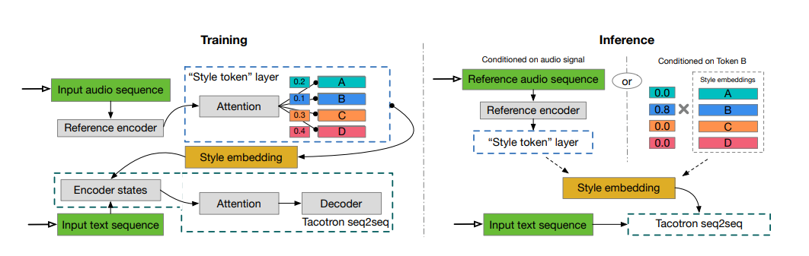

# GST-Tacotron-Pytorch

A PyTorch implementation of  [Style Tokens: Unsupervised Style Modeling, Control and Transfer in End-to-End Speech Synthesis](https://arxiv.org/abs/1803.09017)



## Update
Add support for blizzard dataset.

## Requirements

``` shell
pip3 install -r requirements.txt
```

## File structure

- `Hyperparameters.py` --- hyperparameters
- `Network.py` --- encoder and decoder
- `Modules.py` --- some modules for tacotron
- `Loss.py` --- loss function
- `Data.py` --- dataset loader
- `utils.py` --- some util functions for data I/O
- `Synthesis.py` --- speech generation

## How to train
- Download a multispeaker dataset
- Preprocess your data and implement your `get_XX_data` function in `Data.py`
- Set hyperparameters  in `Hyperparameters.py`
- Make a directory named `log` as follow:

```
--- log
|    |
|    --- log[log_number]
|
--- code
     |
     --- Tacotron
             |
             --- train.py
             |
             --- Network.py
             |
           ......
```

- Run train.py

``` shell
python3 train.py [log_number] [dataset_size] [start_epoch]

[log_number]: the log directory number
[dataset_size]: int or all
[start_epoch]: which epoch start to train (0 if start from scratch )

for example:
python3 train.py 0 all 0
```

## How to generate wav

Run`generate.py`. Replace the `text` in `generate.py` with any chinese sentences as you like before running

> The pretained model provided is trained on Chinese dataset, so it only supports chinese now.

